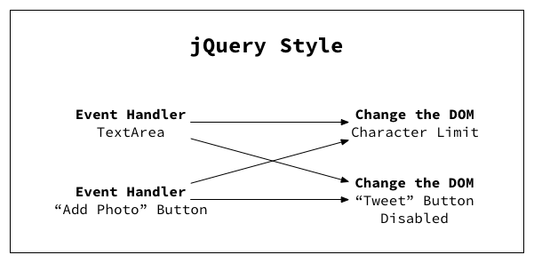
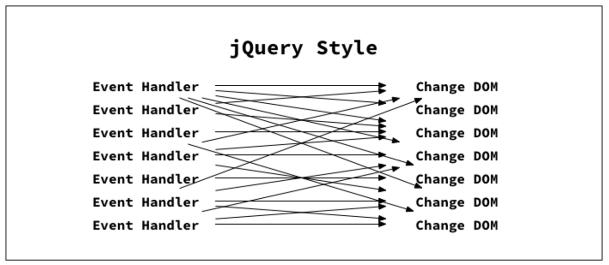

jQuery, You're Great But...It's Just Not Going to Work Out
---------------------------------------
If you've been working on jQuery from quite long, it should have been very clear by now that as the app grows big and bigger,
the code becomes ugly and uglier and it is very hard to understand, maintain and scale the application.

>But the question is: **Why did it get so ugly so fast?**
>
>And the answer has to do with the "jQuery style" of code which does **DOM manipulation**.

it’s possible to write clean jQuery code that doesn’t look like spaghetti. But you have to come up with the code structure yourself and think about how to refactor every time you add a new feature.

Here is an example for you

Let's say we want to build a component that resemble the Tweet box that you find on twitter using jQuery. For every requirement in spec, you can see how it is slowly ugly-*fying* the app. 
Imagine the spec says,

**1. Tweet button is disabled if text area is empty.**

**2. If the "Add Photo" button is ON, the number of available characters decreases by 23.**

**3. Add an alert box with overflow characters highlighted in red, if 160 character limit is reached.**

So on and so forth, you finally end up in mess like this

It is because several event handlers are modifying serveral parts of the DOM and the code gets ugly. In theory, we can mitigiate this problem by refactoring it into reusable functions, but no matter how effictively coded, one who touches the DOM, mess always sticks! 

By the way, do you know DOM manipulation degrades your app performance by threefold?

This is why we shouldn’t “just use jQuery” for every state change in our application. One can think of jQuery like duct tape. It’s amazingly handy for small fixes around the house, but if we keep adding more and more, things will start looking ugly.

Ok..ok..Got it. Long live jQuery! Then how can we make use of existing hell lot of frameworks available online for effective state management to get rid of this spaghetti?