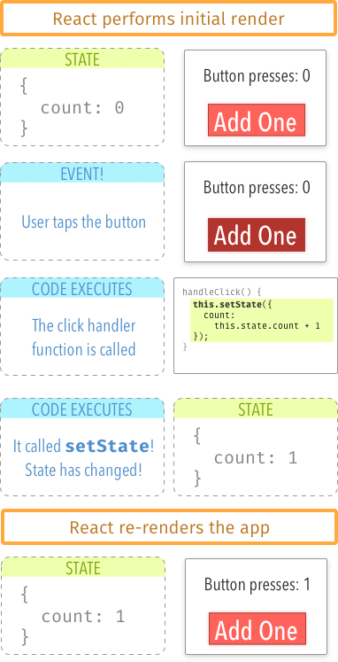
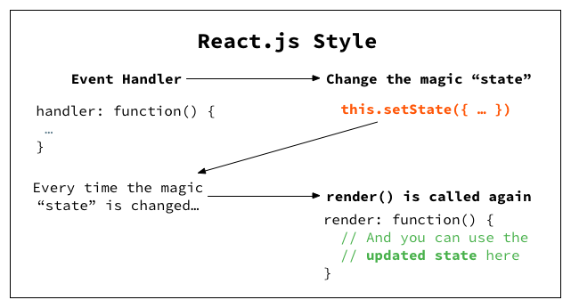
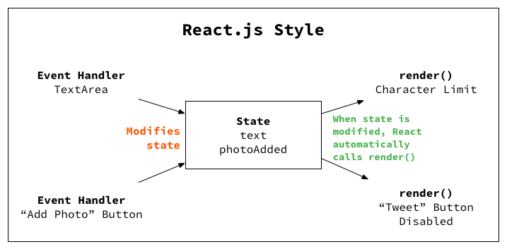

Way to React
-------------
The beauty of React is in it's simple and effective state management using components. It does by enforcing us to think in terms of state without DOM manipulation.

But what is state?
> State is something that changes over time.

In the React sense, “state” is a vanilla JavaScript object that represents the parts of the app that can change. Each component can have its own state.

Simply put, if you’d like your app to do anything – if you want interactivity, adding and deleting things, logging in and out – that will involve state.

**Example**

Let's say we want to update the counter label every time user clicks a button. Here is how it works step by step

1. There’s a number displayed, starting off at 0

2. You click a button (this causes a call to a handleClick function )

3. The counter increments by 1 (you call setState to make this happen)

4. React re-renders the component in response to the state change

In the above example, no where we are touching DOM for state change. 
>So, how does React know that state has changed? Is it continually polling for changes? Watching for events, like Angular does? Nope. Nothing that fancy.
>
>React knows when state has changed because you tell it explicitly, by calling **this.setState** from inside a component. In other words, there’s no “magic.” React will only re-render when you tell it to.

**How does this idea scales well for larger applications?**

Ok. Let's go back to twitter box specs which we did tried to solve using jQuery and ended up in spaghetti.

1. **Tweet button is disabled if text area is empty**

2. **If the "Add Photo" button is ON, the number of available characters decreases by 23**

3. **Add an alert box with overflow characters highlighted in red, if 160 character limit is reached.**

So on and so forth, you end up in uniderctional flow like this compared to jQuery spaghetti code

This idea of unidirectional data flow using state in React saves our lives from complexity when app grows big and bigger.

As per [ThoughtWorks](https://www.thoughtworks.com/radar/languages-and-frameworks),
> In the avalanche of front-end JavaScript frameworks, React.js stands out due to its design around a reactive data flow. Allowing only one-way data binding greatly simplifies the rendering logic and avoids many of the issues that commonly plague applications written with other frameworks. We're seeing the benefits of React.js on a growing number of projects, large and small, while at the same time we continue to be concerned about the state and the future of other popular frameworks like AngularJS. This has led to React.js becoming our default choice for JavaScript frameworks.

Simple and elegant! But how different React is from other front-end frameworks?

 

