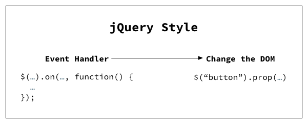
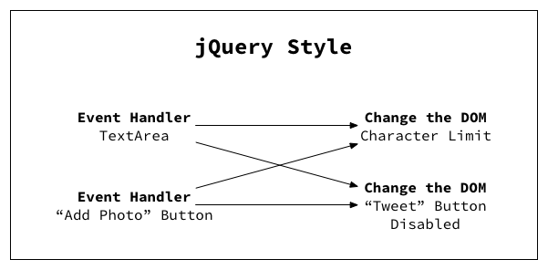
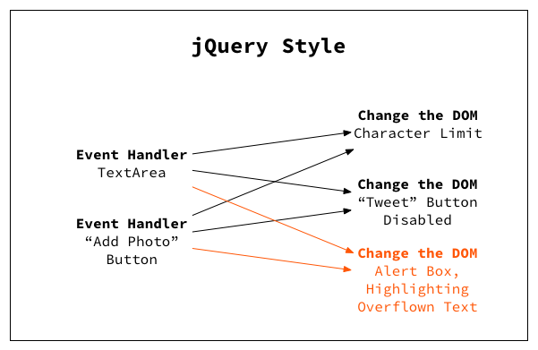
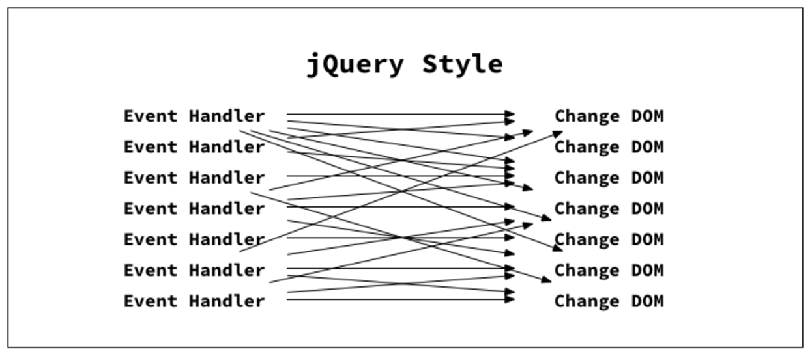
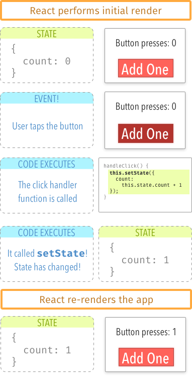
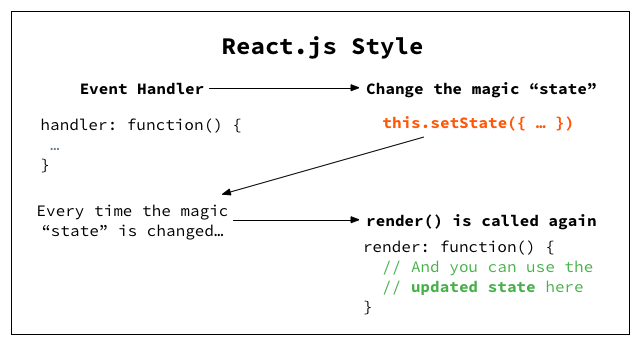
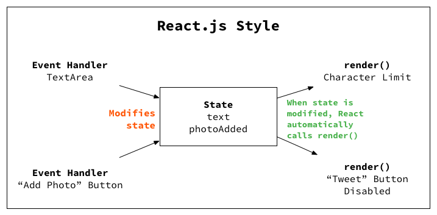
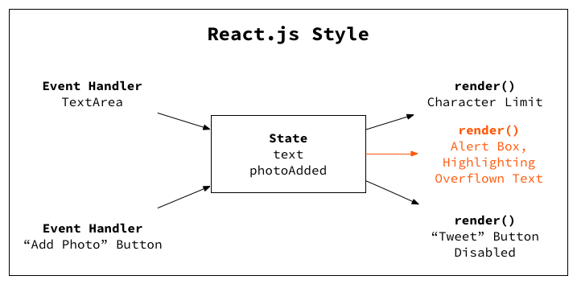

Notes on React
============
Traditional Vs Modern Web Apps
------------------------------

In order to understand where does the complexity lies in modern Javascript apps, we shall understand how they work.

Let's time travel backwards to 2008 apprx.

1. The database sends data to your back-end (e.g. your Java or PHP app).
2. The back-end reads that data and outputs HTML.
3. The HTML is sent to the browser, which displays it as the DOM (basically, a web page).
4. JavaScript code on the client to add interactivity (tabs, modal windows, etc.)

Back to the present, a typical "modern" 2016 web app also known as Single Page App looks like this

1. Instead of sending HTML, the server now sends data along with code(Optional server side rendering for faster loading)
2. The client can swap in content instantly without having to ever refresh the browser window (thus the term “Single Page App”).

As with all aspects of web development, the devil is in the details. It has been pushed from server(backend) to client(frontend) and is sitting now in the Javascript as **STATE**, a place to store and manage data on the client.

Having said that, how did we managed to solve this problem of complexity?

Hmm...How about using jQuery, our old dude who has been helping in 81% of top 1 million websites?!

jQuery, You're Great But...It's Just Not Going to Work Out
---------------------------------------
If you've been working on jQuery from quite long, it should have been very clear by now that as the app grows big and bigger,
the code becomes ugly and uglier and it is very hard to understand, maintain and scale the application.

>But the question is: **Why did it get so ugly so fast?**
>
>And the answer has to do with the "jQuery style" of code which does **DOM manipulation**.

it’s possible to write clean jQuery code that doesn’t look like spaghetti. But you have to come up with the code structure yourself and think about how to refactor every time you add a new feature.

Here is an example for you

Let's say we want to build a component that resemble the Tweet box that you find on twitter using jQuery. For every requirement in spec, you can see how it is slowly ugly-*fying* the app. 
Imagine the spec says,

**1. Tweet button is disabled if text area is empty.**

**2. If the "Add Photo" button is ON, the number of available characters decreases by 23.**

**3. Add an alert box with overflow characters highlighted in red, if 160 character limit is reached.**

So on and so forth, you finally end up in mess like this

It is because several event handlers are modifying serveral parts of the DOM and the code gets ugly. In theory, we can mitigiate this problem by refactoring it into reusable functions, but no matter how effictively coded, one who touches the DOM, mess always sticks! 

By the way, do you know DOM manipulation degrades your app performance by threefold?

This is why we shouldn’t “just use jQuery” for every state change in our application. One can think of jQuery like duct tape. It’s amazingly handy for small fixes around the house, but if we keep adding more and more, things will start looking ugly.

Ok..ok..Got it. Long live jQuery! Then how can we make use of existing hell lot of frameworks available online for effective state management to get rid of this spaghetti?

Why React is safest bet?
------------------------
As they say, 2016 is an year of Javascript fatigue. But what is it?!

Let's play a game.
Write down all the frameworks/build tools/libraries you can think of for 30 seconds straight and then stop.

Ready,  set,  go!

>Ember, Angular, React, Express, Grunt, Bower, npm, Broccoli, Gulp, Lodash, Underscore, rxjs, Knockout, SocketIO, Threejs, D3, Backbone, Ionic, Angular2, React Native, Redux, Alt, Reflux, Webpack, Bluebird, Q, Express, Mocha, Jasmine, Chai, Koa, Less, Sass, Postcss, Impressjs, Revealjs.

Tired yet? In short, that’s what **JavaScript fatigue** is.

You know what? We are suffering with *paradox of choice*. Let's put all the bells and whistles aside.

We just know JavaScript and we love it. We wan't to stand on the shoulder of this giant to solve the state management problem, the root cause of all this evil, which has been pushed from backend to frontend, no matter which framework comes and go. 
1. As JavaScript tackles bigger and more complex problems, We want a higher level of abstraction without much variance from the language itself.
2. We don't want to carry away with the drift of technologies, language syntax and semantics, unnecessary services and controllers which may not be needed in our app.
3. We want something that is easy to reason about and don't want any auto-*magic* to happen under the hood within a framework/library.
4. In simple, we want a view layer that *just* takes care of "data to HTML".

Having said this, **React** from Facebook exactly solves this problem.

It is a declarative, efficient, and flexible JavaScript library for building user interfaces. It will introduce some useful concepts like components, application state and stateless functions that will prove useful even in Vanilla Javascript apps or no matter which framework or libraries one end up using.

It's true strengths are **composition, unidirectional data flow, freedom from DSLs(Domain Specific Languages), explicit mutation and static mental model.**

It  has a large ecosystem of other packages and libraries that you can plug and play when it is needed in your app instead of dumping everything on your head, and its sheer popularity(>50K stars in github) means you’ll be able to find a lot of help from community.

**TL; DR**

In short, React forces you to think and write better JavaScript apps that scales, not a framework oriented apps.

>Do you know React being a View library can be integrated into any of **MV*** frameworks as a view layer?

Wow!! You'he sold me. But, how does React solves our old problem of complexity? How does it effectively handles the state?

Way to React
-------------
The beauty of React is in it's simple and effective state management using components. It does by enforcing us to think in terms of state without DOM manipulation.

But what is state?
> State is something that changes over time.

In the React sense, “state” is a vanilla JavaScript object that represents the parts of the app that can change. Each component can have its own state.

Simply put, if you’d like your app to do anything – if you want interactivity, adding and deleting things, logging in and out – that will involve state.

**Example**

Let's say we want to update the counter label every time user clicks a button. Here is how it works step by step
1. There’s a number displayed, starting off at 0
2. You click a button (this causes a call to a handleClick function )
3. The counter increments by 1 (you call setState to make this happen)
4. React re-renders the component in response to the state change

In the above example, no where we are touching DOM for state change. 
>So, how does React know that state has changed? Is it continually polling for changes? Watching for events, like Angular does? Nope. Nothing that fancy.
>
>React knows when state has changed because you tell it explicitly, by calling **this.setState** from inside a component. In other words, there’s no “magic.” React will only re-render when you tell it to.

**How does this idea scales well for larger applications?**

Ok. Let's go back to twitter box specs which we did tried to solve using jQuery and ended up in spaghetti.

1. **Tweet button is disabled if text area is empty**

2. **If the "Add Photo" button is ON, the number of available characters decreases by 23**

3. **Add an alert box with overflow characters highlighted in red, if 160 character limit is reached.**

So on and so forth, you end up in uniderctional flow like this compared to jQuery spaghetti code

This idea of unidirectional data flow using state in React saves our lives from complexity when app grows big and bigger.

Simple but elegant! But how different React is from other front-end frameworks?

 

