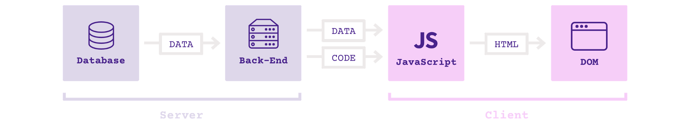

Traditional Vs Modern Web Apps
------------------------------

In order to understand where does the complexity lies in modern Javascript apps, we shall understand how they work.

Let's time travel backwards to 2008 apprx.

1. The database sends data to your back-end (e.g. your Java or PHP app).
2. The back-end reads that data and outputs HTML.
3. The HTML is sent to the browser, which displays it as the DOM (basically, a web page).
4. JavaScript code on the client to add interactivity (tabs, modal windows, etc.)

Back to the present, a typical "modern" 2016 web app also known as Single Page App looks like this

1. Instead of sending HTML, the server now sends data along with code(Optional server side rendering for faster loading)
2. The client can swap in content instantly without having to ever refresh the browser window (thus the term “Single Page App”).

As with all aspects of web development, the devil is in the details. It has been pushed from server(backend) to client(frontend) and is sitting now in the Javascript as **STATE**, a place to store and manage data on the client.

Having said that, how did we managed to solve this problem of complexity?

Hmm...How about using jQuery, our old dude who has been helping in 81% of top 1 million websites?!